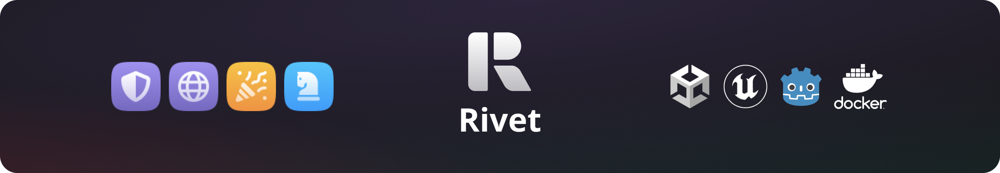
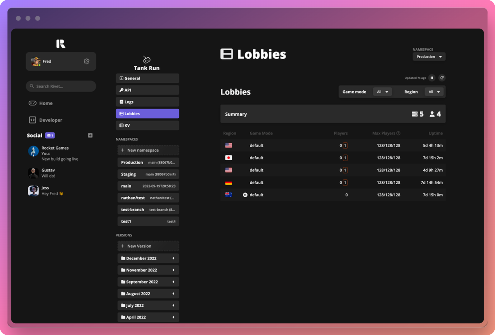

  

  <i>Managed game servers, matchmaking, and DDoS mitigation that lets you focus on building your game.</i>

  
  
  
  

  <a href="https://rivet.gg/">Home</a> - <a href="https://docs.rivet.gg/">Docs</a> - <a href="https://twitter.com/rivet_gg">Twitter</a> - <a href="https://discord.gg/BG2vqsJczH">Discord</a>

## 👾 Features

-   Everything is accessible from an easy to use [GUI, CLI, or API](https://docs.rivet.gg/general/gui-cli-api)
-   [Serverless Lobbies](https://docs.rivet.gg/serverless-lobbies/introduction) for auto-scaling game lobbies
-   [Flexible matchmaker](https://docs.rivet.gg/matchmaker/introduction) for placing players in lobbies with no wait times
-   [CDN](https://docs.rivet.gg/cdn/introduction) for hosting assets and webpages with a custom domain or provided rivet.game subdomain
-   [Game Guard](https://docs.rivet.gg/serverless-lobbies/concepts/game-guard) for DDoS mitigation and managed WebSocket SSL, TCP+TLS, and UDP
-   Streamlined DevOps for teams
-   Unified logging & monitoring & analytics
-   No downtime deploys with easy rollbacks

  

## 🚀 Getting Started

### Rivet Cloud

[Rivet Cloud](https://rivet.gg) is the fastest way to get your game up and running. Sign up at [rivet.gg](https://rivet.gg) and get a free game server.

### Self-hosting

See the [setup guide](/docs/getting_started/DEVELOPMENT.md) to develop & deploy Rivet yourself.

## 📐 Architecture

Below is a simplified architecture diagram of a Rivet cluster.

## 📖 Documentation Overview

> **Looking for documentation on building a game with Rivet?**
>
> Visit our [documentation for game developers](https://docs.rivet.gg/)!

**Getting Started**

-   [Project Structure](/docs/getting_started/PROJECT_STRUCTURE.md)
-   [Developing on Rivet](/docs/getting_started/DEVELOPMENT.md)
-   [Error Handling](/docs/libraries/chirp/ERROR_HANDLING.md)

**Philosophy**

-   [Why open source](/docs/philosophy/WHY_OPEN_SOURCE.md)

**Architecture**

-   [Software Bill of Materials](/docs/infrastructure/SBOM.md)

**About**

-   [Notable missing features](/docs/about/MISSING_FEATURES.md)
