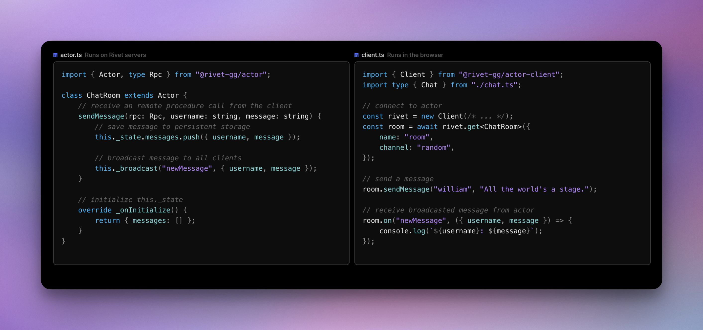
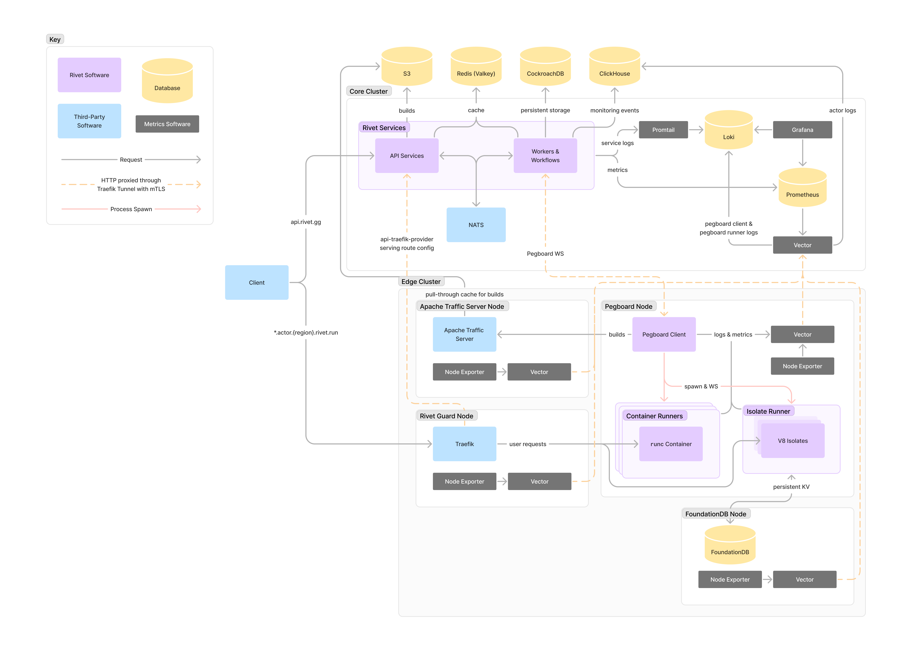

<p align="center">
  <a href="https://rivet.gg">
    <picture>
      <source media="(prefers-color-scheme: dark)" srcset="./.github/media/icon-text-white.svg" alt="Rivet">
      
    </picture>
  </a>
</p>


<p align="center">
  <p align="center"><b>Run and scale realtime applications</b><br/>Rivet Actors have built-in RPC, state, and events — the easiest way to build modern applications.</p>
</p>

<p align="center">
  <a href="/docs/philosophy/LICENSING.md"></a>
  <a href="https://github.com/rivet-gg/rivet/graphs/commit-activity"></a>
  
  <a href="https://rivet.gg/discord"></a>
</p>



## Features

### Rivet Actors

- [**Remote Procedure Calls**](https://rivet.gg/docs/rpc): Create cross-application function calls with minimal code overhead.
- [**State**](https://rivet.gg/docs/state): Automatically manage and persist your data with built-in state handling.
- [**Events**](https://rivet.gg/docs/events): Manage real-time state changes using integrated pub/sub messaging.
- [**Scaling & Concurrency**](https://rivet.gg/docs/scaling): Actors scale automatically to cover regions and process needs.
- [**Edge Networking**](https://rivet.gg/docs/edge): Automatically distribute your applications to global edge locations.

Learn more about actors [here](https://rivet.gg/docs/actors).

### Infrastructure

- **Runs globally near your users**: Minimize latency with actors created in regions closest to your users.
- **Scales to zero**: Handle millions of connections with low latency and high-throughput writes while saving costs through instant actor sleep/wake cycles.
- **Built-in monitoring**: Includes monitoring out of the box.
- **Supports data localization**: Store data in designated locations to meet data localization compliance requirements.
- **Powered by V8 isolates & Deno runtime**: Faster, cheaper, and more lightweight than lambda functions & containers.
- **Supports both isolates & containers**: Run your code on V8 isolates or run things like Godot/Unity game servers or video encoding in containers.
- **Built with technologies you can trust**: Rust, FoundationDB, the [Rivet workflow engine](docs-internal/libraries/workflow/OVERVIEW.md), and [Rivet orchestrator](packages/services/pegboard/) make Rivet  delightfully boring to use.

### Use cases

- Collaborative applications
- Local-first apps
- AI agents
- Discord Activities
- Game Servers
- Chat Apps
- Yjs Sync & Storage
- Run Untrusted User Code

## Quickstart

### Install CLI

_Install the CLI on your machine in order to create & deploy Rivet Actors._

<details>
<summary><b>macOS & Linux & WSL</b></summary>

```sh
curl -fsSL https://releases.rivet.gg/rivet/24.6.0-rc.1/install.sh | sh
```

Next, follow the [setup guide](https://rivet.gg/docs/setup).

</details>

<details>
<summary><b>Windows (cmd)</b></summary>

**Install latest version**

```ps1
powershell -Command "iwr https://releases.rivet.gg/rivet/24.6.0-rc.1/install.ps1 -useb | iex"
```

Next, follow the [setup guide](https://rivet.gg/docs/setup).

</details>

<details>
<summary><b>Windows (PowerShell)</b></summary>

```
iwr https://releases.rivet.gg/rivet/24.6.0-rc.1/install.ps1 -useb | iex
```

Next, follow the [setup guide](https://rivet.gg/docs/setup).

</details>

<details>
<summary><b>Build from source (<code>cargo build</code>)</b></summary>

```sh
git clone https://github.com/rivet-gg/rivet
cargo build --bin rivet
```

The executable will be available at _target/debug/rivet_.

Next, follow the [setup guide](https://rivet.gg/docs/setup).

</details>

### Single-node cluster

_Run a single-node Rivet instance for developing your applications locally._

<details>
<summary><b><code>docker run</code></b></summary>

Start a Rivet cluster:

```sh
docker run --name rivet -v "$(pwd)/rivet-data:/data" -p 8080:8080 -p 9000:9000 -p 7080:7080 -p 7443:7443 --platform linux/amd64 rivetgg/rivet
```

Next, follow the [setup guide](https://rivet.gg/docs/setup).

</details>

<details>
<summary><b><code>docker run</code> with TCP & UDP</b></summary>

Start a Rivet cluster with TCP & UDP enabled:

```sh
docker run --name rivet -v "$(pwd)/rivet-data:/data" -p 8080:8080 -p 9000:9000 -p 7080:7080 -p 7443:7443 -p 7500-7599:7500-7599 -p 7600-7699:7600-7699 --platform linux/amd64 rivetgg/rivet
```

Next, follow the [setup guide](https://rivet.gg/docs/setup).

</details>

<details>
<summary><b>Integrate in to your Docker Compose</b></summary>

Integrate in to an your existing project's Docker Compose with:

```yaml
services:
  rivet:
    image: rivetgg/rivet
    platform: linux/amd64
    volumes:
      - rivet-data:/data
    ports:
      - "8080:8080"
      - "9000:9000"
      - "7080:7080"
      - "7443:7443"
      # Optional: Rivet Guard TCP & UDP
      - "7500-7599:7500-7599"
      # Optional: Host networking TCP & UDP
      - "7600-7699:7600-7699"

volumes:
  rivet-data:
```

Next, follow the [setup guide](https://rivet.gg/docs/setup).

</details>

### Developing Rivet

_Compile Rivet from scratch and start a full cluster._

<details>
<summary><b>Docker Compose</b></summary>

Build & start the cluster with:

```yaml
docker compose -f docker/dev-full/docker-compose.yml up -d
```

Then visit http://localhost:8080 in your browser.

</details>

### Self-hosting & manual deployment

Read our [self-hosting documentation](https://rivet.gg/docs/self-hosting).

### Rivet Cloud

Rivet Cloud is the fastest, most affordable, and most reliable way to deploy Rivet Actors with zero infrastructure maintenance. Get started at [hub.rivet.gg](https://hub.rivet.gg).

### Rivet Enterprise

Get a demo, tailored pricing to fit your needs, or have your questions answered about Rivet. Contact us [here](https://rivet.gg/sales).

## Documentation

- **Overview**
  - [Overview](https://rivet.gg/docs)

- **Getting Started**
  - [Initial Setup](https://rivet.gg/docs/setup)
  - [What Are Actors?](https://rivet.gg/docs/actors)
  - [Actor SDK](https://jsr.io/@rivet-gg/actor/doc) (external)
  - **Client SDKs**
    - [JavaScript & TypeScript](https://rivet.gg/docs/client/javascript)

- **Build with Rivet**
  - [Remote Procedure Calls](https://rivet.gg/docs/rpc)
  - [State](https://rivet.gg/docs/state)
  - [Events](https://rivet.gg/docs/events)
  - [Scaling & Concurrency](https://rivet.gg/docs/scaling)
  - [Edge Networking](https://rivet.gg/docs/edge)
  - **More**
    - [Lifecycle](https://rivet.gg/docs/lifecycle)
    - [Connections](https://rivet.gg/docs/connections)
    - [Authentication](https://rivet.gg/docs/authentication)
    - [Fault Tolerance](https://rivet.gg/docs/fault-tolerance)
    - [Logging](https://rivet.gg/docs/logging)

- **Resources**
  - [Configuration](https://rivet.gg/docs/config)
  - [Troubleshooting](https://rivet.gg/docs/troubleshooting)
  - **Self-Hosting**
    - [Overview](https://rivet.gg/docs/self-hosting)
    - [Docker Compose](https://rivet.gg/docs/self-hosting/docker-compose)
    - [Manual Deployment](https://rivet.gg/docs/self-hosting/manual-deployment)
    - [Server Config](https://rivet.gg/docs/self-hosting/server-config)
    - [Client Config](https://rivet.gg/docs/self-hosting/client-config)
  - **More**
    - [Available Regions](https://rivet.gg/docs/regions)
    - [Limitations](https://rivet.gg/docs/limitations)
    - **Advanced**
      - [Rescheduling](https://rivet.gg/docs/rescheduling)
      - [Networking](https://rivet.gg/docs/networking)
      - **Internals**
        - [Design Decisions](https://rivet.gg/docs/internals/design-decisions)
        - [Actor Runtime](https://rivet.gg/docs/internals/runtime)
- [Platform API](https://rivet.gg/docs/api)

## Community & Support

- Join our [Discord](https://rivet.gg/discord)
- Follow us on [X](https://x.com/rivet_gg)
- Follow us on [Bluesky](https://bsky.app/profile/rivet-gg.bsky.social)
- File bug reports in [GitHub Issues](https://github.com/rivet-gg/rivet/issues)
- Post questions & ideas in [GitHub Discussions](https://github.com/orgs/rivet-gg/discussions)

## Architecture

### Core technologies

- **Rust**
- **V8 & Deno**: Actor isolate runtime
- **FoundationDB**: Actor state
- **CockroachDB**: OLTP
- **ClickHouse**: Developer-facing monitoring
- **Valkey**: Caching
- **NATS**: Pub/sub
- **Traefik**: Load balancers & tunnels

### Diagram



## Project layout

```
docker/                      Docker-related files
    client/                  Client image
    dev-full/                Full development environment setup
    monolith/                Monolithic Docker setup
    server/                  Server image
docs/                        Documentation
docs-internal/               Internal documentation
examples/                    Example projects
packages/                    Project packages
    api/                     API package
    common/                  Common utilities
    infra/                   Infrastructure-related code
    services/                Service implementations
    toolchain/               Toolchain-related code
resources/                   Resource files
scripts/                     Scripts for various tasks
sdks/                        SDKs
    actor/                   Actor SDK
    api/                     API SDK
```

## License

Apache 2.0
