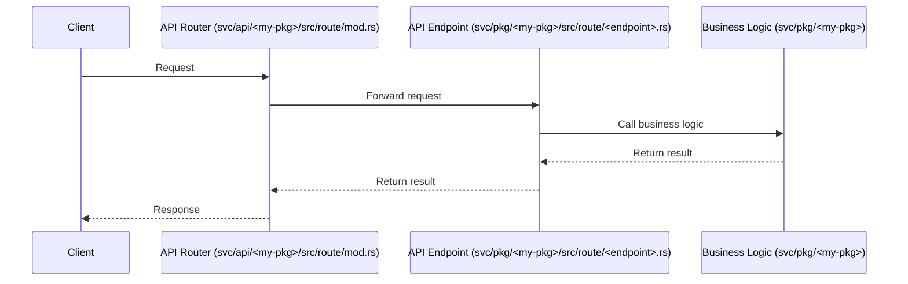

## Project Structure

**🗄️ Configuration**

```
namespaces/                      Configuration for your Rivet cluster
secrets/                         Credentials & secrets
```

**⚙️ Services**

```
svc/                       Source code for services
  api/                     Public-facing API services
  pkg/                     Internal business logic
    my-pkg/
      db/                  Database migrations
      ops/                 Operations used within other packages
      worker/              Chirp worker
      standalone/          CRON, headless, and oneoff services
      types/               Package-specific Protobuf types
lib/                             Internal libraries
fern/                            API type definitions (buildwithfern.com)
proto/                           Protobuf types (protobuf.dev)
```

**💻 Development**

```
CHANGELOG.md                     keepachangelog.com
shell.nix                        Nix shell configuration (provides dev tools)
doc/                             Internal documentation
errors/                          Documentation of all error types used in Rivet
templates/                       Templates used for bootstrapping services
tests/                           Misc system tests
```

**🏗️ Infrastructure**

```
infra/
  tf/                            Terraform state files
  docker/                        Docker images required for Rivet's infra
  tests/                         Infra tests
  nix/                           Shared Nix configs
```

When making a new endpoint, you'll need to add files in the following locations:

1. **API Definition**: `fern/definition/<my-pkg>/<endpoint>/__package.yml`: This is where the API definition goes.

1. **API Router**: `svc/api/<my-pkg>/src/route/mod.rs`: This might call an `op!` or a `msg!` from the business logic.

1. **API Endpoint**: `svc/pkg/<my-pkg>/src/route/<endpoint>.rs`: The handler for the route goes here.

1. **Business Logic**: `svc/pkg/<my-pkg>`: This is where the actual business logic goes.



Notes:
- When working on endpoints, you need to include crates for adding ops, messages, and other dependencies.