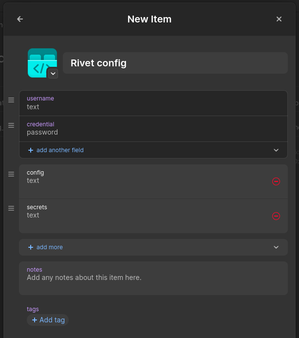
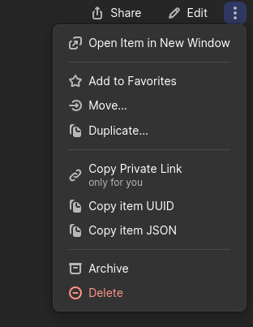

# 1Password Config Management

Bolt can optionally use 1password as a database for namespace and secrets management.

When set up, bolt will automatically check if your config is up to date with the version in 1password before
important commands like `bolt up` and `bolt infra up`.

## Setup

To begin, you must first create a new item in 1password and add two text fields (you can remove the rest). The
names of the fields are not important:

<p align="center">
  
</p>

you will need to copy its UUID:

<p align="center">
  
</p>

Finally, you have two options for pushing your local config to 1password:

1. #### Add the following to your namespace config (located in the `/namespaces` folder):

   You can [generate a service token](https://developer.1password.com/docs/service-accounts/) and write it to
   your `Bolt.local.toml` file to make config syncing quicker:

   ```toml
   [1password]
   	service-account-token = "..."
   ```

   Then, write the 1password config paths to your namespace file:

   ```toml
   [secrets.1password]
   	namespace_path = "op://<NAME OF 1PASSWORD VAULT>/<YOUR UUID>/<NAME OF CONFIG FIELD>"
   	secrets_path = "op://<NAME OF 1PASSWORD VAULT>/<YOUR UUID>/<NAME PF SECRETS FIELD>"
   ```

   Finally, run `bolt config push`.

2. #### Run `bolt config push` and input values manually

   This method will require you to input the 1password item paths and login details manually. It is
   recommended to use option 1 instead.

   Path formats:

   - Config: `op://<NAME OF 1PASSWORD VAULT>/<YOUR UUID>/<NAME OF CONFIG FIELD>`
   - Secrets: `op://<NAME OF 1PASSWORD VAULT>/<YOUR UUID>/<NAME PF SECRETS FIELD>`

## Pulling

To pull your config from 1password run `bolt config pull`, or `bolt config pull <namespace>` for a specific
namespace.
