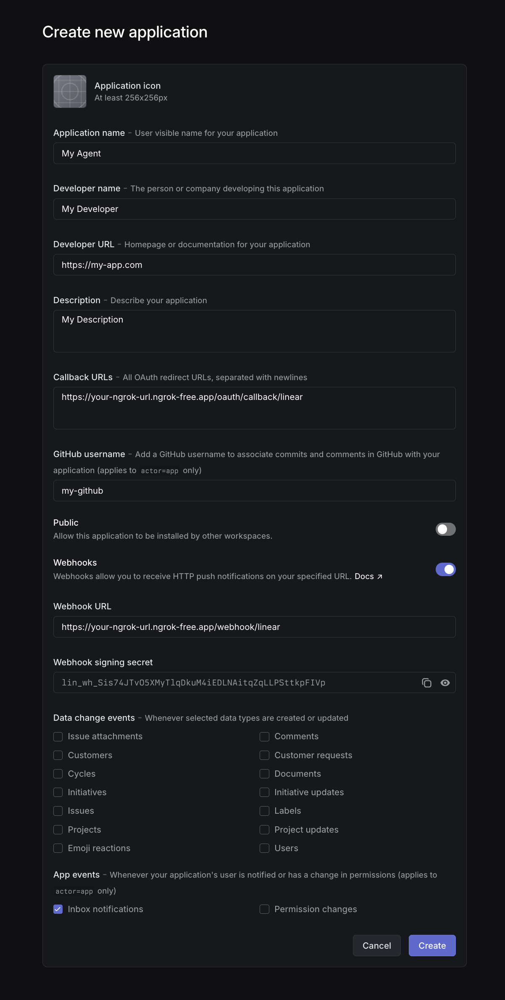

# Linear Agent Starter

A starter template for building a Linear agent using [Rivet](https://rivet.gg) and [ActorCore](https://actorcore.org). This example agent helps developers by generating code based on issue descriptions and requirements.

The agent can:
- Act on issues when assigned to it
- React to comment mentions with 👀 and generate code-focused responses

This simple example serves as a starting point for building more sophisticated Linear agents. For full documentation on Linear Agents, see the [Linear Agents documentation](https://linear.app/developers/agents).

## Getting Started

## TL;DR

See `src/actors/issue-agent.ts` for the brains of the whole thing.

### Prerequisites

- Node.js (v18+)
- Linear account and API access
- Anthropic API key (can be swapped for any [AI SDK provider](https://ai-sdk.dev/docs/foundations/providers-and-models))
- [ngrok](https://ngrok.com/download) for exposing your local server to the internet

### Setup and Configuration

1. Clone the repository and navigate to the example:
   ```bash
   git clone https://github.com/rivet-gg/rivet.git
   cd rivet/examples/linear-agent-starter
   ```

2. Install dependencies:
   ```bash
   npm install
   ```
3. Set up ngrok for webhook and OAuth callback handling:

   ```bash
   # With a consistent URL (recommended)
   ngrok http 5050 --url=YOUR-NGROK-URL
   
   # Or without a consistent URL
   ngrok http 5050
   ```
   
4. Create a Linear OAuth application:
   1. Go to to [Linear's create application page](https://linear.app/settings/api/applications/new)
   2. Enter your _Application name_, _Developer name_, _Developer URL_, _Description_, and _GitHub username_ for your agent
   3. Set _Callback URL_ to `https://YOUR-NGROK-URL/oauth/callback/linear` (replace `YOUR-NGROK-URL` with your actual [ngrok URL](https://ngrok.com/docs/universal-gateway/domains/))
      * This URL is where Linear will redirect after OAuth authorization
   4. Enable webhooks
   5. Set _Webhook URL_ to `https://YOUR-NGROK-URL/webhook/linear` (use the same ngrok URL)
      * This URL is where Linear will send events when your agent is mentioned or assigned
   6. Enable _Inbox notifications_ webhook events
   7. Create the application to get your _Client ID_, _Client Secret_, and webhook _Signing secret_
   
   <p align="center">
   
   </p>

5. Create a `.env.local` file with your credentials:
   ```
   LINEAR_OAUTH_CLIENT_ID=<client id>
   LINEAR_OAUTH_CLIENT_AUTHENTICATION=<client secret>
   LINEAR_OAUTH_REDIRECT_URI=https://YOUR-NGROK-URL/oauth/callback/linear
   LINEAR_WEBHOOK_SECRET=<webhook signing secret>
   ANTHROPIC_API_KEY=<your_anthropic_api_key>
   ```
   
   Remember to replace `YOUR-NGROK-URL` with your actual ngrok URL (without the https:// prefix).

### Running the Development Server

```bash
npm run dev
```

The server will start on port 5050. Visit http://127.0.0.1:5050/connect-linear to add the agent to your workspace.

### Testing the Agent

Once the agent is installed in your workspace, create a new issue and assign it to the agent. The agent will generate code for you based on your issue.

You can mention the agent in comments to iterate on the code.

## Architecture

This project uses [ActorCore](https://actorcore.org) to manage stateful actors with a [Hono](https://hono.dev/) HTTP server.

### Actors

All actor files are located in the `src/actors/` directory:

- **Issue Agent** (`src/actors/issue-agent.ts`): Handles Linear issue events and generates responses
- **Linear App User** (`src/actors/linear-app-user.ts`): Manages authentication state for the application
- **OAuth Session** (`src/actors/oauth-session.ts`): Handles OAuth flow state

### Server Endpoints

The server implementation is in `src/server/index.ts`:

- `GET /connect-linear`: Initiates the Linear OAuth flow
- `GET /oauth/callback/linear`: OAuth callback endpoint
- `POST /webhook/linear`: Receives Linear webhook events

The server handles the OAuth flow, authenticates with Linear, and routes events to the appropriate actors for processing.
